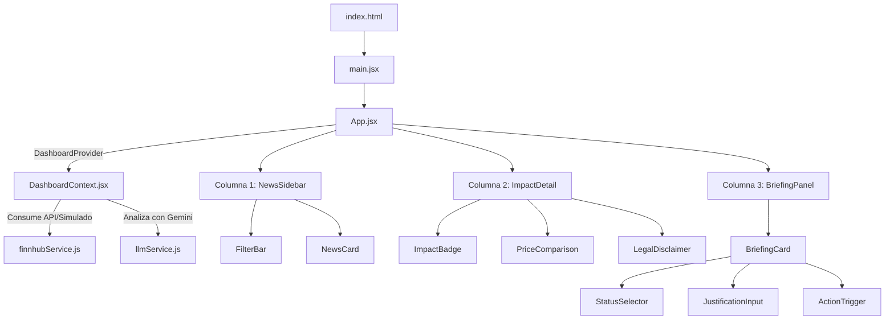

# Registro Detallado de Avances y Nueva Arquitectura (Track 5)

Este documento contiene la especificación técnica completa y el resumen detallado de los avances realizados en la refactorización e integración del prototipo de **Inteligencia de Mercado y Recomendaciones Financieras**.

---

## 1. Resumen de la Refactorización
El prototipo inicial contaba con una base de datos local estática y renderizado monolítico en `App.jsx`. Se realizó una transición hacia una arquitectura desacoplada y orientada a servicios que permite la integración fluida con feeds financieros reales y procesamiento cognitivo mediante Inteligencia Artificial (LLM).

---

## 2. Especificación de los Servicios (`src/services/`)

### A. [`mockData.js`](file:///c:/Users/DIEGO/Documents/GitHub/agentic-scale/src/services/mockData.js)
Centraliza las colecciones de datos simulados:
- **`INITIAL_ASSETS`**: Definición de los activos financieros cubiertos por la plataforma (Acciones, Criptoactivos, Instrumentos de crédito, Otros) con sus respectivos tickers (`NVDA`, `BTC`, `US10Y`, `GLD`, etc.).
- **`INITIAL_NEWS`**: Registro semilla de 6 noticias financieras de muestra con análisis previos ya incorporados.
- **`INITIAL_BRIEFINGS`**: Reportes de briefing de ejemplo en estado "Pendiente" y "Revisada" para la inicialización inicial del flujo.

### B. [`finnhubService.js`](file:///c:/Users/DIEGO/Documents/GitHub/agentic-scale/src/services/finnhubService.js)
Conecta la aplicación al API de **Finnhub** para consumir feeds de noticias del mercado financiero:
- **Endpoint Utilizado**: `https://finnhub.io/api/v1/news?category=general`
- **Mapeo de Datos**: Transforma el formato nativo de Finnhub a la estructura unificada de la aplicación:
  - `datetime` (segundos unix) ➔ `date` (ISO string).
  - `related` (ticker string único) ➔ `assets` (array de tickers).
- **Mecanismo de Resiliencia (Mock Fallback)**: Si no se encuentra una clave `VITE_FINNHUB_API_KEY` válida en `.env.local`, o si la petición falla debido a límites de la API, el servicio captura el error, emite un aviso en la consola de desarrollo, y retorna la lista de `INITIAL_NEWS` con un retraso asíncrono realista (800ms) para no romper la experiencia del usuario.

### C. [`llmService.js`](file:///c:/Users/DIEGO/Documents/GitHub/agentic-scale/src/services/llmService.js)
Conecta el panel al modelo de lenguaje **Gemini 2.5 Flash** para generar explicaciones, justificaciones y análisis históricos de impacto.
- **Transmisión de Entrada**: Recibe el titular (`headline`), resumen crudo (`summary`) y activos vinculados (`assets`).
- **Prompt Estructurado**: Diseñado para forzar al modelo a responder estrictamente en formato JSON utilizando las siguientes llaves:
  - `impact`: Dirección proyectada del impacto ("Positivo", "Negativo", "Neutral", "Incierto").
  - `confidence`: Nivel de certeza cuantitativo (1-100%).
  - `explanation`: Descripción lógica del mecanismo de transmisión de mercado.
  - `evidence`: Datos, citas o métricas presentes en la noticia que respaldan la tesis.
  - `historicalComparison`: Correlaciones del pasado y precedentes estadísticos.
  - `watchlist`: Nombre de la lista de seguimiento sugerida (ej. 'Tecnología y Crecimiento', 'Activos Digitales').
  - `associatedMovement`: Proyección técnica de precio a corto plazo.
  - `suggestedAction`: Recomendación de acción inmediata para el analista.
- **Simulador Heurístico Inteligente**: En ausencia de la API key `VITE_GEMINI_API_KEY`, el servicio ejecuta una clasificación heurística analizando el texto en busca de palabras clave bajistas (ej. *drop*, *fall*, *ban*, *limit*) y alcistas (ej. *beat*, *rally*, *gain*, *inflow*), construyendo respuestas de análisis realistas y personalizadas (incluyendo watchlists, acciones sugeridas y movimientos estimados) para cada ticker a fin de asegurar la demostración offline del flujo de IA.

---

## 3. Estado Centralizado y Persistencia (`src/context/`)

### [`DashboardContext.jsx`](file:///c:/Users/DIEGO/Documents/GitHub/agentic-scale/src/context/DashboardContext.jsx)
Implementa un patrón de proveedor de estado (`useContext`) gobernado por un `useReducer`:

- **Acciones Disponibles (`dispatch`)**:
  - `SET_NEWS_LOADING` / `SET_NEWS`: Carga y listado asíncrono de noticias en el radar.
  - `ADD_NEWS`: Inserción inmediata de noticias creadas manualmente a través del simulador de eventos.
  - `SELECT_NEWS_ID`: Selección activa de una noticia.
  - `SET_ANALYSIS_LOADING` / `UPDATE_ANALYSIS` / `SET_ANALYSIS_ERROR`: Control del estado del pipeline del LLM.
  - `ADD_BRIEFING`: Creación de una tarea de revisión a partir del impacto generado por la IA.
  - `UPDATE_BRIEFING_STATUS`: Actualización de estado en el flujo humano (`Revisada`, `Escalada`, `Descartada`).
  - `UPDATE_BRIEFING_JUSTIFICATION`: Almacena la redacción técnica aportada por el analista.
  - `TOGGLE_ALERT`: Habilita/Deshabilita una alerta para el equipo.
  - `SET_FILTERS`: Actualización de filtros cruzados.

- **Persistencia Local (`LocalStorage`)**:
  El contexto lee los briefings almacenados en el almacenamiento local del navegador (`scale_agents_briefings`) durante la inicialización. Cualquier cambio en las notas, justificaciones o estados se sincroniza automáticamente en segundo plano, persistiendo los avances del analista tras recargar la pantalla.

- **Efecto de Análisis Automatizado**:
  Un efecto reactivo monitorea los cambios en `selectedNewsId`. Si el usuario hace clic en una noticia cargada directamente de Finnhub (que no tiene análisis de impacto de IA previos), el contexto dispara automáticamente la llamada al servicio de Gemini, actualiza el estado de carga y fusiona la respuesta en la noticia en memoria de forma transparente.

---

## 4. Componentes UI Creados (`src/components/`)

### A. Columna 1: Radar de Noticias
- **[`FilterBar.jsx`](file:///c:/Users/DIEGO/Documents/GitHub/agentic-scale/src/components/FilterBar.jsx)**: Cuadro de búsqueda de texto reactivo y selectores para aislar noticias por tipo de instrumento (acciones, cripto, crédito) o ticker específico.
  - *Filtro de Antigüedad Dinámico*: Se reemplazó el selector dropdown por un **diseño de botones de radio de tipo píldora** (`radio-pill-group`), permitiendo al usuario seleccionar temporalidades rápidamente con retroalimentación visual directa (activo/inactivo).
- **[`NewsCard.jsx`](file:///c:/Users/DIEGO/Documents/GitHub/agentic-scale/src/components/NewsCard.jsx)**: Tarjeta individual para mostrar el titular, la fuente original de la noticia, la fecha y etiquetas dinámicas con los tickers.
  - *Interactividad Añadida*: Las etiquetas de los tickers son ahora **click-filtrables** (`.click-filterable`). Al hacer clic en una de ellas, el dashboard completo se filtra automáticamente para ese activo en particular.
- **[`NewsSidebar.jsx`](file:///c:/Users/DIEGO/Documents/GitHub/agentic-scale/src/components/NewsSidebar.jsx)**: Contenedor lateral encargado de aplicar las combinaciones de filtros en memoria al array de noticias global.

### B. Columna 2: Señal de Impacto Explicable
- **[`ImpactBadge.jsx`](file:///c:/Users/DIEGO/Documents/GitHub/agentic-scale/src/components/ImpactBadge.jsx)**: Renderiza las métricas clave de la IA. Cambia de color según la dirección: verde esmeralda para bullish (`Positivo`), rojo suave para bearish (`Negativo`), y ámbar para `Neutral` e `Incierto`.
- **[`PriceComparison.jsx`](file:///c:/Users/DIEGO/Documents/GitHub/agentic-scale/src/components/PriceComparison.jsx)**: Muestra la comparativa de comportamiento de mercado histórica y proyectada.
  - *Interactividad Visual*: Incorpora un **gráfico de tendencias dinámico mediante SVG** que traza una curva de rendimiento de 5 días (`T-2` a `T+2` días). La dirección de la curva (alcista, bajista o lateral) y el color de sombreado y brillo se adaptan instantáneamente según el impacto estimado por la IA.
- **[`LegalDisclaimer.jsx`](file:///c:/Users/DIEGO/Documents/GitHub/agentic-scale/src/components/LegalDisclaimer.jsx)**: Descargo de riesgo legal estático visible obligatoriamente en pantalla.
- **[`ImpactDetail.jsx`](file:///c:/Users/DIEGO/Documents/GitHub/agentic-scale/src/components/ImpactDetail.jsx)**: Panel central que visualiza el resumen, la justificación de la IA y los datos de respaldo de la noticia activa.
  - *UX Mejorada*: Cuando se está ejecutando la llamada de análisis a Gemini, este componente sustituye el contenido por una interfaz animada de **Skeleton Loaders** de carga.

### C. Columna 3: Briefing de Mercado y Flujo Humano
- **[`StatusSelector.jsx`](file:///c:/Users/DIEGO/Documents/GitHub/agentic-scale/src/components/StatusSelector.jsx)**: Selector para que el analista defina el estado de revisión.
- **[`JustificationInput.jsx`](file:///c:/Users/DIEGO/Documents/GitHub/agentic-scale/src/components/JustificationInput.jsx)**: Área de texto obligatorio para justificaciones.
- **[`ActionTrigger.jsx`](file:///c:/Users/DIEGO/Documents/GitHub/agentic-scale/src/components/ActionTrigger.jsx)**: Disparador de envío de alertas.
- **[`BriefingCard.jsx`](file:///c:/Users/DIEGO/Documents/GitHub/agentic-scale/src/components/BriefingCard.jsx)**: Tarjeta de reporte que engloba los campos de revisión.
  - *UX Mejorada*: Al activar/desactivar la alerta de revisión, se inyecta una notificación temporal tipo **Toast** en la esquina superior de la tarjeta indicando el envío seguro de la tarea.
- **[`BriefingPanel.jsx`](file:///c:/Users/DIEGO/Documents/GitHub/agentic-scale/src/components/BriefingPanel.jsx)**: Contenedor de la columna derecha para listar los reportes consolidados creados.

---

## 5. Diseño y Estilos de Interfaz (`src/App.css`)

Se agregaron al final del archivo CSS de estilos globales las siguientes reglas visuales premium:
- **Skeleton Loader Animado**:
  - `.skeleton-container`, `.skeleton-box`, `.skeleton-line`.
  - Animación de parpadeo suave mediante una transición cíclica de opacidad (`pulse` de 0.5 a 0.15) de 1.6 segundos de duración (`animate-pulse`).
- **Notificaciones Toast Temporales**:
  - `.toast-notification`: Capas elevadas y posicionamiento absoluto.
  - Animación `fadeInOut` de 3.2 segundos que maneja una entrada suave de deslizamiento vertical (`translateY`) seguida de un desvanecimiento final progresivo.
- **Spinners y Estados**:
  - Spinner rotativo de carga `.spinner` utilizando fotogramas clave `@keyframes spin`.
  - Clases especiales para el badge `.pending-analysis` en tonos amarillos suaves.
- **Estilos del Gráfico SVG e Interacción de Tickers**:
  - `.trend-chart-container` y `.trend-svg`: Maquetan el fondo translúcido y la escala del gráfico de líneas SVG.
  - `.click-filterable`: Define transiciones suaves de color y transforma el puntero a cursor interactivo en las etiquetas.

---

## 6. Validación de Construcción y Sintaxis
- **Instalación de Dependencias**: Completada con éxito a nivel local.
- **Verificación de Tipos y Construcción**: `npm run build` ejecutado de manera óptima, compilando el bundle de producción en el directorio `/dist` sin registrar fallos de Vite ni advertencias críticas.
- **Verificación de Linter**: Ejecución de `npm run lint` limpia de variables huérfanas o importaciones no deseadas.
