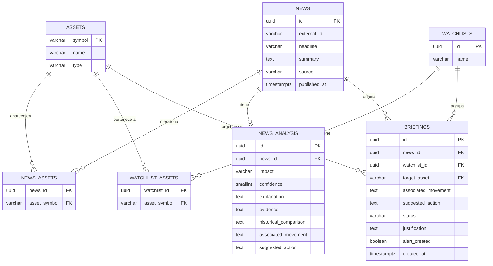

# Diseño de Base de Datos — Agentic Scale (Track 5)
### De localStorage a persistencia real

## Objetivo

Actualmente el proyecto almacena noticias, briefings, watchlists y resultados del análisis de IA utilizando `localStorage`. El objetivo de este documento es proponer un esquema de base de datos relacional que permita migrar esa persistencia a una base de datos real, facilitando la implementación del backend y manteniendo la arquitectura del proyecto.

---

## 1. Qué guarda hoy el proyecto (análisis del código)

| Clave en localStorage | Contenido | Objeto React |
|---|---|---|
| `scale_agents_news_data` | Noticias (crudas + analizadas) | `state.news` |
| `scale_agents_news_cache` | Cache de análisis de IA por titular | usado antes de llamar a Gemini |
| `scale_agents_briefings` | Briefings | `state.briefings` |
| `scale_agents_watchlists` | Watchlists | `state.watchlists` |

**Problemas a resolver con la BD:**

1. El briefing hoy referencia la noticia por `newsHeadline` (texto), no por `id` → debe ser una FK real.
2. `assets` es un array embebido en noticias y watchlists → en realidad es una relación muchos a muchos.
3. Los datos de la IA (`impact`, `confidence`, `explanation`...) están mezclados con la noticia cruda → conviene separarlos para poder re-analizar sin tocar el dato original.

*(No hay login en el proyecto ni sistema de notificaciones real, así que el esquema no incluye tablas para eso — ver sección 5, "Fuera de alcance por ahora".)*

---

## 2. Entidades

| Entidad | Por qué existe |
|---|---|
| `assets` | Catálogo único de instrumentos (acciones, cripto, crédito, otros). |
| `news` | Noticia cruda (Finnhub / Alpha Vantage / Currents / datos de prueba). |
| `news_assets` | M:N — una noticia toca varios activos, un activo aparece en varias noticias. |
| `news_analysis` | Análisis del Agente IA (impacto, confianza, explicación), separado de la noticia cruda. |
| `watchlists` | Listas de seguimiento. |
| `watchlist_assets` | M:N — una watchlist tiene varios activos. |
| `briefings` | Resumen accionable que el analista revisa/escala/descarta (HU3). |

---

## 3. Diagrama ER (Mermaid)



---

## 4. Esquema SQL (PostgreSQL / Supabase)

```sql
CREATE EXTENSION IF NOT EXISTS "pgcrypto";

CREATE TYPE instrument_type AS ENUM ('Acciones', 'Criptoactivos', 'Instrumentos de crédito', 'Otros');
CREATE TYPE impact_type AS ENUM ('Positivo', 'Negativo', 'Neutral', 'Incierto');
CREATE TYPE briefing_status AS ENUM ('Pendiente', 'Revisada', 'Escalada', 'Descartada');

CREATE TABLE assets (
    symbol      VARCHAR(20) PRIMARY KEY,
    name        VARCHAR(150) NOT NULL,
    type        instrument_type NOT NULL
);

CREATE TABLE news (
    id                  UUID PRIMARY KEY DEFAULT gen_random_uuid(),
    external_id         VARCHAR(150),
    source              VARCHAR(100) NOT NULL,
    headline            VARCHAR(500) NOT NULL,
    translated_headline VARCHAR(500),
    summary             TEXT,
    translated_summary  TEXT,
    published_at        TIMESTAMPTZ NOT NULL,
    ingested_at         TIMESTAMPTZ NOT NULL DEFAULT now(),
    UNIQUE (external_id, source)
);

CREATE TABLE news_assets (
    news_id      UUID NOT NULL REFERENCES news(id) ON DELETE CASCADE,
    asset_symbol VARCHAR(20) NOT NULL REFERENCES assets(symbol),
    PRIMARY KEY (news_id, asset_symbol)
);

CREATE TABLE news_analysis (
    id                    UUID PRIMARY KEY DEFAULT gen_random_uuid(),
    news_id               UUID NOT NULL UNIQUE REFERENCES news(id) ON DELETE CASCADE,
    impact                impact_type NOT NULL,
    confidence            SMALLINT NOT NULL CHECK (confidence BETWEEN 1 AND 100),
    explanation           TEXT NOT NULL,
    evidence              TEXT NOT NULL,
    historical_comparison TEXT,
    associated_movement   TEXT,
    suggested_action      TEXT,
    analyzed_at           TIMESTAMPTZ NOT NULL DEFAULT now()
);

CREATE TABLE watchlists (
    id   UUID PRIMARY KEY DEFAULT gen_random_uuid(),
    name VARCHAR(150) NOT NULL UNIQUE
);

CREATE TABLE watchlist_assets (
    watchlist_id UUID NOT NULL REFERENCES watchlists(id) ON DELETE CASCADE,
    asset_symbol VARCHAR(20) NOT NULL REFERENCES assets(symbol),
    PRIMARY KEY (watchlist_id, asset_symbol)
);

CREATE TABLE briefings (
    id                  UUID PRIMARY KEY DEFAULT gen_random_uuid(),
    news_id             UUID NOT NULL REFERENCES news(id) ON DELETE CASCADE,
    watchlist_id        UUID REFERENCES watchlists(id) ON DELETE SET NULL,
    watchlist_label     VARCHAR(150), -- respaldo si no hay watchlist_id (ej. "Análisis Especial (NVDA)")
    target_asset        VARCHAR(20) NOT NULL REFERENCES assets(symbol),
    associated_movement TEXT,
    suggested_action    TEXT,
    status              briefing_status NOT NULL DEFAULT 'Pendiente',
    justification       TEXT NOT NULL DEFAULT '',
    alert_created       BOOLEAN NOT NULL DEFAULT false,
    created_at          TIMESTAMPTZ NOT NULL DEFAULT now(),
    updated_at          TIMESTAMPTZ NOT NULL DEFAULT now()
);

CREATE INDEX idx_news_published_at ON news (published_at DESC);
CREATE INDEX idx_briefings_status ON briefings (status);
```

**Cambio clave vs. hoy:** `briefings.news_id` es una FK real a `news.id`, reemplazando el `newsHeadline` de texto libre que usa el código actual.

---

## 5. Fuera de alcance por ahora (para no sobre-diseñar)

- **Usuarios / autenticación:** el proyecto no tiene login. Se puede incorporar en una futura versión agregando una tabla `users` y las columnas `owner_id` / `analyst_id` como FK nullable, sin romper este esquema.
- **Tabla de alertas:** el criterio del hackathon solo pide "crear alertas o tareas para revisión humana", y eso ya lo cumple la columna `alert_created` (booleano) en `briefings`. Una tabla `alerts` con historial y canal de envío puede agregarse después si se necesita.

---

## 6. Firestore / Supabase

- **Supabase:** es Postgres puro → el SQL de la sección 4 se usa literal. Si más adelante agregan auth, usan `auth.users` de Supabase en vez de crear tabla propia.
- **Firestore (NoSQL):** las relaciones M:N se resuelven con arrays embebidos, igual a como ya lo hace `state.news[].assets` en React hoy:
  ```
  /news/{newsId} → { headline, summary, source, publishedAt, assetSymbols: ["NVDA","TSLA"], analysis: {...} }
  /watchlists/{id} → { name, assetSymbols: [...] }
  /briefings/{id} → { newsId, watchlistId, targetAsset, status, justification, alertCreated }
  ```
  No hay FOREIGN KEY que valide la integridad — eso hay que garantizarlo desde el backend/Cloud Functions.

**Recomendación para las 48 horas:** Supabase, porque este esquema se usa tal cual, sin traducir nada.