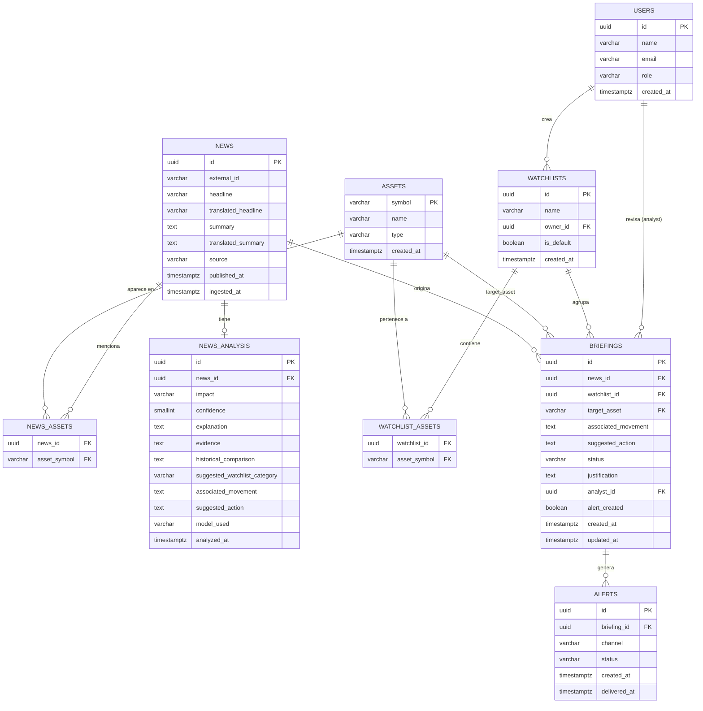

# Diseño de Base de Datos — Agentic Scale (Track 5)
### De localStorage a persistencia real

---

## 1. Análisis del estado actual (basado en el código real)

Revisando `DashboardContext.jsx`, `mockData.js`, `llmService.js` y los servicios de noticias, esto es lo que hoy vive en `localStorage`:

| Clave en localStorage | Qué guarda | Objeto React equivalente |
|---|---|---|
| `scale_agents_news_data` | Lista de noticias (crudas + ya analizadas) | `state.news` |
| `scale_agents_news_cache` | Cache de análisis de IA por `headline` (texto) | usado para no re-llamar a Gemini |
| `scale_agents_briefings` | Lista de briefings | `state.briefings` |
| `scale_agents_watchlists` | Listas de seguimiento | `state.watchlists` |

**Objetos que maneja React hoy:**

- **Noticia (`news`)**: `id`, `headline`, `source`, `date`, `assets[]`, `summary`, y campos que llena la IA: `impact`, `confidence`, `explanation`, `evidence`, `historicalComparison`, más `translatedHeadline`/`translatedSummary`, `watchlist`, `associatedMovement`, `suggestedAction`.
- **Activo (`asset`)**: `symbol`, `name`, `type` (Acciones, Criptoactivos, Instrumentos de crédito, Otros) — catálogo fijo en `mockData.js`, pero también aparecen tickers "desconocidos" que llegan de las noticias.
- **Watchlist**: `name`, `assets[]` (array de símbolos).
- **Briefing**: `id`, `watchlist` (string libre), `targetAsset`, **`newsHeadline` (texto, no un ID)**, `associatedMovement`, `suggestedAction`, `status`, `justification`, `alertCreated`.

### Problemas de diseño que detecté (y que la BD debe resolver)

1. **El briefing referencia la noticia por `newsHeadline` (texto), no por `id`.** Eso es un anti-patrón: si el titular cambia (ej. se traduce con Gemini) o se repite, se rompe la relación. En la BD esto debe ser una **llave foránea real** a `news.id`.
2. **`assets` es un array embebido** tanto en noticias como en watchlists. Un activo (ej. `NVDA`) aparece en muchas noticias y en muchas watchlists → es una relación **muchos a muchos**, no un array.
3. **Los datos de la IA (`impact`, `confidence`, `explanation`...) están mezclados en el mismo objeto que la noticia cruda.** Esto no permite re-analizar una noticia, guardar historial de análisis, ni saber qué modelo generó qué. Deben separarse.
4. **`watchlist` en un briefing es un string libre** (`"Análisis Especial (NVDA)"`, `"Lista: Tecnología"`), no una referencia real a la tabla `watchlists`. Hay que decidir si es una FK opcional o un texto libre de respaldo (lo resuelvo abajo).
5. **No existe el concepto de "analista/usuario"** todavía (no hay login), pero la Historia de Usuario 3 exige "revisión humana" y guardar justificación — la BD debe dejar el campo listo aunque hoy no haya auth.
6. **`alertCreated` es solo un booleano.** Cumple el criterio mínimo ("crea alertas... no ejecuta compras/ventas"), pero si quieren mostrar historial de alertas (cuándo se creó, a quién se le avisó), conviene una tabla separada. La dejo como **mejora opcional**, no obligatoria.

---

## 2. Entidades del sistema

| Entidad | Por qué existe |
|---|---|
| `assets` | Catálogo único de instrumentos financieros (acciones, cripto, crédito, otros). Evita repetir "NVIDIA Corp." en cada noticia. |
| `news` | Noticia cruda tal como llega de Finnhub/Alpha Vantage/Currents o de datos de prueba. |
| `news_assets` | Tabla intermedia: una noticia puede tocar varios activos, un activo aparece en varias noticias (M:N). |
| `news_analysis` | El análisis generado por el Analista de Coyuntura de Mercados IA (impacto, confianza, explicación, evidencia, comparación histórica). Separado de `news` porque es un dato derivado, re-generable y con su propio ciclo de vida (async). |
| `users` | Analistas/asesores que revisan señales y escriben justificación (HU3). No existe login aún, pero el esquema lo deja listo. |
| `watchlists` | Listas de seguimiento creadas por el usuario. |
| `watchlist_assets` | Tabla intermedia: una watchlist tiene varios activos, un activo puede estar en varias watchlists (M:N). |
| `briefings` | El resumen accionable que un analista revisa, escala o descarta (HU3). Conecta noticia + activo + watchlist. |
| `alerts` *(opcional, recomendada)* | Historial de alertas/tareas creadas a partir de un briefing, en vez de un simple booleano. |

---

## 3. Diagrama Entidad-Relación (Mermaid)



---

## 4. Llaves primarias, foráneas y por qué

- **`assets.symbol` es PK** (ej. `NVDA`, `BTC`) en vez de un `id` autogenerado, porque el símbolo bursátil **ya es el identificador natural** que usan todas las APIs externas (Finnhub, Alpha Vantage) y el propio código (`item.assets: ['NVDA']`). Usarlo como PK evita una capa extra de mapeo.
- **`news.id` es UUID**, y se guarda además `external_id` (ej. `finnhub-123456`) para poder hacer *upsert* sin duplicar cuando la misma noticia llega dos veces desde la API (tu código ya deduplica por `headline` en el front; en BD es mejor deduplicar por `external_id` + `source`, que es más confiable que el texto del titular).
- **`news_analysis.news_id` es FK única (1:1)** con `news.id` — hoy solo hay un análisis por noticia, pero separarlo permite en el futuro guardar varias corridas de análisis sin tocar la tabla `news`.
- **`briefings.news_id` es FK obligatoria a `news.id`** — esto reemplaza el actual `newsHeadline` de texto libre. Es el cambio más importante del rediseño.
- **`briefings.watchlist_id` es FK opcional (nullable)** — porque tu código permite crear un briefing "suelto" desde una noticia individual (`createBriefing`) sin que pertenezca a ninguna watchlist formal (aparece como `"Análisis Especial (NVDA)"`). Si es nulo, se puede seguir mostrando ese texto como campo descriptivo aparte, o usar `watchlist_label` como columna de respaldo (ver notas del SQL).
- **`briefings.target_asset` es FK a `assets.symbol`.**
- **`watchlists.owner_id` y `briefings.analyst_id` son FK a `users.id`, nullable** — porque hoy no hay login. Cuando lo implementen, simplemente dejan de ser nulos.

## 5. Relaciones muchos a muchos

Detecté dos relaciones M:N reales en tu modelo de datos actual (los arrays `assets`):

1. **Noticia ↔ Activo** → tabla intermedia `news_assets(news_id, asset_symbol)`.
2. **Watchlist ↔ Activo** → tabla intermedia `watchlist_assets(watchlist_id, asset_symbol)`.

Ambas con PK compuesta para evitar duplicados (no tiene sentido que el mismo activo esté dos veces en la misma noticia o watchlist).

## 6. Por qué ciertos datos no deben duplicarse

- **El nombre y tipo del activo** (`"NVIDIA Corp."`, `"Acciones"`) vive **solo** en `assets`. Hoy `getAssetName()`/`getAssetType()` en `mockData.js` resuelven esto con lógica hardcodeada en el frontend; en BD es una sola fila reutilizada por todas las noticias, watchlists y briefings que mencionen `NVDA`. Si mañana cambian el nombre de un activo, se actualiza en un solo lugar.
- **El titular de la noticia** no debe copiarse dentro de `briefings` (como pasa hoy con `newsHeadline`). Si la IA traduce o corrige el titular después, el briefing automáticamente refleja el dato correcto porque apunta al mismo `news.id`, en vez de quedar con una copia vieja del texto.
- **El análisis de la IA** (`impact`, `confidence`, `explanation`...) no debe repetirse en cada briefing que se cree a partir de la misma noticia (tu código actual sí copia `associatedMovement`/`suggestedAction` en cada briefing — lo dejo como columna en `briefings` porque el analista puede editarlo/ajustarlo al escalar, pero el análisis "original" de la IA queda intacto en `news_analysis` como fuente de verdad).

---

## 7. Esquema SQL (PostgreSQL)

```sql
CREATE EXTENSION IF NOT EXISTS "pgcrypto"; -- para gen_random_uuid()

CREATE TYPE instrument_type AS ENUM ('Acciones', 'Criptoactivos', 'Instrumentos de crédito', 'Otros');
CREATE TYPE impact_type AS ENUM ('Positivo', 'Negativo', 'Neutral', 'Incierto');
CREATE TYPE briefing_status AS ENUM ('Pendiente', 'Revisada', 'Escalada', 'Descartada');
CREATE TYPE user_role AS ENUM ('analista', 'asesor', 'admin');
CREATE TYPE alert_status AS ENUM ('Pendiente', 'Enviada', 'Atendida');

-- 1. Catálogo de activos
CREATE TABLE assets (
    symbol      VARCHAR(20) PRIMARY KEY,
    name        VARCHAR(150) NOT NULL,
    type        instrument_type NOT NULL,
    created_at  TIMESTAMPTZ NOT NULL DEFAULT now()
);

-- 2. Usuarios (analistas / asesores) — listo para cuando exista auth
CREATE TABLE users (
    id          UUID PRIMARY KEY DEFAULT gen_random_uuid(),
    name        VARCHAR(150) NOT NULL,
    email       VARCHAR(150) UNIQUE NOT NULL,
    role        user_role NOT NULL DEFAULT 'analista',
    created_at  TIMESTAMPTZ NOT NULL DEFAULT now()
);

-- 3. Noticias crudas (de Finnhub, Alpha Vantage, Currents o datos de prueba)
CREATE TABLE news (
    id                  UUID PRIMARY KEY DEFAULT gen_random_uuid(),
    external_id         VARCHAR(150),          -- ej. 'finnhub-123456'
    source              VARCHAR(100) NOT NULL, -- ej. 'Bloomberg', 'Reuters'
    headline            VARCHAR(500) NOT NULL,
    translated_headline VARCHAR(500),
    summary             TEXT,
    translated_summary  TEXT,
    published_at        TIMESTAMPTZ NOT NULL,
    ingested_at         TIMESTAMPTZ NOT NULL DEFAULT now(),
    UNIQUE (external_id, source)
);

CREATE INDEX idx_news_published_at ON news (published_at DESC);

-- 4. Relación M:N noticia-activo
CREATE TABLE news_assets (
    news_id      UUID NOT NULL REFERENCES news(id) ON DELETE CASCADE,
    asset_symbol VARCHAR(20) NOT NULL REFERENCES assets(symbol) ON DELETE RESTRICT,
    PRIMARY KEY (news_id, asset_symbol)
);

CREATE INDEX idx_news_assets_symbol ON news_assets (asset_symbol);

-- 5. Análisis generado por el Agente IA (Gemini) — 1:1 con news
CREATE TABLE news_analysis (
    id                             UUID PRIMARY KEY DEFAULT gen_random_uuid(),
    news_id                        UUID NOT NULL UNIQUE REFERENCES news(id) ON DELETE CASCADE,
    impact                         impact_type NOT NULL,
    confidence                     SMALLINT NOT NULL CHECK (confidence BETWEEN 1 AND 100),
    explanation                    TEXT NOT NULL,
    evidence                       TEXT NOT NULL,
    historical_comparison          TEXT,
    suggested_watchlist_category   VARCHAR(150),
    associated_movement            TEXT,
    suggested_action               TEXT,
    model_used                     VARCHAR(50) NOT NULL DEFAULT 'gemini-2.0-flash',
    analyzed_at                    TIMESTAMPTZ NOT NULL DEFAULT now()
);

-- 6. Watchlists
CREATE TABLE watchlists (
    id          UUID PRIMARY KEY DEFAULT gen_random_uuid(),
    name        VARCHAR(150) NOT NULL,
    owner_id    UUID REFERENCES users(id) ON DELETE SET NULL,
    is_default  BOOLEAN NOT NULL DEFAULT false,
    created_at  TIMESTAMPTZ NOT NULL DEFAULT now(),
    UNIQUE (owner_id, name)
);

-- 7. Relación M:N watchlist-activo
CREATE TABLE watchlist_assets (
    watchlist_id UUID NOT NULL REFERENCES watchlists(id) ON DELETE CASCADE,
    asset_symbol VARCHAR(20) NOT NULL REFERENCES assets(symbol) ON DELETE RESTRICT,
    PRIMARY KEY (watchlist_id, asset_symbol)
);

-- 8. Briefings (HU3: revisión humana)
CREATE TABLE briefings (
    id                   UUID PRIMARY KEY DEFAULT gen_random_uuid(),
    news_id              UUID NOT NULL REFERENCES news(id) ON DELETE CASCADE,
    watchlist_id         UUID REFERENCES watchlists(id) ON DELETE SET NULL,
    watchlist_label       VARCHAR(150), -- respaldo de texto libre si no hay watchlist_id (ej. "Análisis Especial (NVDA)")
    target_asset         VARCHAR(20) NOT NULL REFERENCES assets(symbol) ON DELETE RESTRICT,
    associated_movement  TEXT,
    suggested_action     TEXT,
    status               briefing_status NOT NULL DEFAULT 'Pendiente',
    justification        TEXT NOT NULL DEFAULT '',
    analyst_id           UUID REFERENCES users(id) ON DELETE SET NULL,
    alert_created        BOOLEAN NOT NULL DEFAULT false,
    created_at           TIMESTAMPTZ NOT NULL DEFAULT now(),
    updated_at           TIMESTAMPTZ NOT NULL DEFAULT now()
);

CREATE INDEX idx_briefings_status ON briefings (status);
CREATE INDEX idx_briefings_news_id ON briefings (news_id);

-- 9. Alertas (opcional, mejora sobre el booleano alert_created)
CREATE TABLE alerts (
    id            UUID PRIMARY KEY DEFAULT gen_random_uuid(),
    briefing_id   UUID NOT NULL REFERENCES briefings(id) ON DELETE CASCADE,
    channel       VARCHAR(50) NOT NULL DEFAULT 'sistema', -- ej. 'email', 'slack'
    status        alert_status NOT NULL DEFAULT 'Pendiente',
    created_at    TIMESTAMPTZ NOT NULL DEFAULT now(),
    delivered_at  TIMESTAMPTZ
);

CREATE INDEX idx_alerts_briefing_id ON alerts (briefing_id);
```

**Nota sobre `alerts`:** es opcional para el mínimo del hackathon — el criterio de aceptación solo pide que "cree alertas o tareas para revisión humana", y el booleano `alert_created` en `briefings` ya lo cumple. Agregué la tabla porque, si tienen tiempo, demuestra mejor arquitectura (historial, canal, estado de entrega) sin romper nada: pueden quedarse solo con el booleano y listo.

---

## 8. Cómo se vería en Firestore (NoSQL) o Supabase

### Opción A — Supabase
Supabase **es PostgreSQL** por debajo, así que el SQL de arriba se usa literal, tal cual, sin cambios. La única diferencia es que además obtienen:
- Auth ya integrado → resuelve `users` gratis (usan `auth.users` y referencian `auth.users(id)` en vez de crear su propia tabla `users`).
- Row Level Security (RLS): por ejemplo, en `watchlists` y `briefings` podrían restringir que cada analista solo vea/edite lo suyo, con una policy tipo `owner_id = auth.uid()`.
- Cliente JS (`@supabase/supabase-js`) reemplaza directamente las llamadas a `localStorage.getItem/setItem` por `supabase.from('news').select()` — el cambio en el frontend sería mínimo.

**Recomendación:** para este proyecto, Supabase es la opción más rápida de implementar en 48 horas, porque el esquema relacional que diseñé arriba se usa sin traducir nada.

### Opción B — Firebase Firestore (NoSQL, documentos)
Firestore no tiene JOINs ni tablas intermedias, así que el diseño cambia de forma (denormalizar donde antes usábamos M:N):

```
/assets/{symbol}                → { name, type }

/news/{newsId}                  → {
                                     externalId, source, headline, translatedHeadline,
                                     summary, translatedSummary, publishedAt,
                                     assetSymbols: ["NVDA", "TSLA"]   // array embebido, no junction table
                                   }

/news/{newsId}/analysis/current → { impact, confidence, explanation, evidence,
                                     historicalComparison, associatedMovement,
                                     suggestedAction, modelUsed, analyzedAt }
                                   // subcolección 1:1, o simplemente un campo "analysis: {...}" dentro del doc de news

/watchlists/{watchlistId}       → { name, ownerId, assetSymbols: ["BTC","ETH"] }

/briefings/{briefingId}         → { newsId, watchlistId, watchlistLabel, targetAsset,
                                     associatedMovement, suggestedAction, status,
                                     justification, analystId, alertCreated, createdAt }

/briefings/{briefingId}/alerts/{alertId} → { channel, status, createdAt, deliveredAt }

/users/{userId}                 → { name, email, role }
```

**Diferencias clave a explicarle a tu equipo:**
- Las relaciones M:N (`news_assets`, `watchlist_assets`) se resuelven con **arrays de símbolos embebidos** (`assetSymbols: []`), igual a como ya lo hace tu `state.news[].assets` en React hoy — de hecho es el modelo más parecido a lo que ya tienen.
- Para filtrar "noticias que mencionan NVDA" en Firestore se necesita un índice sobre el array (`array-contains`), disponible de forma nativa.
- No hay `FOREIGN KEY` que la BD valide por ti: la integridad referencial (que `newsId` en un briefing exista de verdad) hay que garantizarla desde el código del backend/Cloud Functions.
- Firestore es buena opción si van a desplegar rápido sin backend propio (reglas de seguridad declarativas), pero para un dominio tan relacional como este (noticias↔activos↔watchlists↔briefings), Postgres/Supabase modela mejor las relaciones reales sin duplicar datos.

---

## 9. Resumen de decisiones para tu equipo

- **Cambio más importante:** `briefings` deja de guardar `newsHeadline` como texto y pasa a tener `news_id` (FK real).
- Los arrays `assets` (en noticias y watchlists) se convierten en tablas intermedias M:N (`news_assets`, `watchlist_assets`) en el mundo SQL, o quedan como arrays embebidos en Firestore.
- El análisis de IA se separa de la noticia cruda (`news_analysis`), para no mezclar dato "de la fuente" con dato "generado por el modelo".
- `users` y `analyst_id`/`owner_id` quedan preparados aunque hoy no haya login — así no hay que rediseñar cuando lo agreguen.
- `alerts` es una mejora opcional; el booleano actual (`alert_created`) sigue siendo válido para el mínimo del hackathon.
