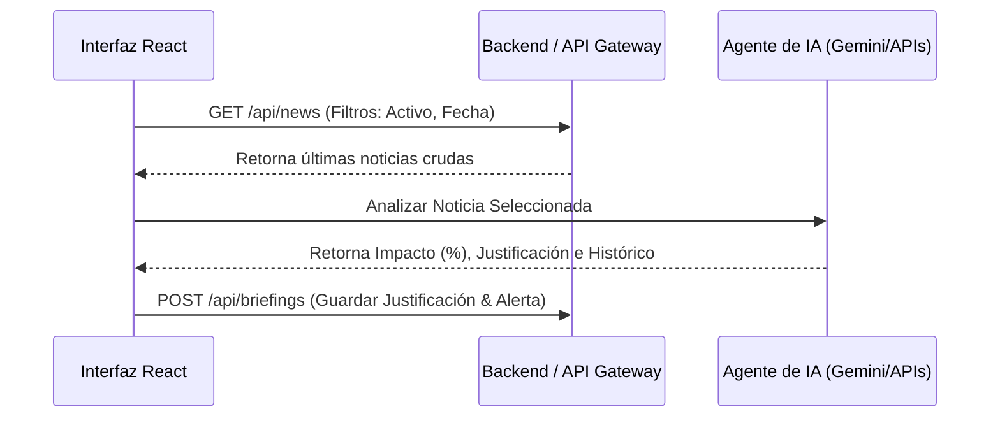

# Plan de Implementación: Inteligencia de Mercado (Track 5)

Este plan de desarrollo detalla la hoja de ruta y la arquitectura del prototipo interactivo en React. Servirá como el documento de referencia continuo para registrar los avances, pruebas y futuras integraciones del proyecto.

---

## 🚦 Fases del Desarrollo (Construcción Rápida)

### Fase 1: Maquetación y Hoja de Estilos Premium (Visuals & CSS)
*   **Objetivo:** Crear una interfaz de usuario fluida, adaptable y con colores sofisticados de estilo financiero (dark mode).
*   **Acciones:**
    *   Reemplazar [index.css](file:///Users/lolothens/Code/agentic-scale/agentic-scale/src/index.css) con las variables de diseño base y fuentes premium (Inter).
    *   Actualizar [App.css](file:///Users/lolothens/Code/agentic-scale/agentic-scale/src/App.css) para maquetar la estructura de tres columnas usando CSS Grid.
*   **Efectos visuales:** Diseñar micro-animaciones en hover sobre las tarjetas de noticias y los botones de acción del briefing.

### Fase 2: Interactividad y Filtros Reactivos (H.U. 1)
*   **Objetivo:** Permitir al analista buscar e identificar de forma precisa la información que le interesa.
*   **Acciones:**
    *   Cargar base de datos inicial de prueba con noticias de Bloomberg, Reuters y Financial Times asociadas a Tickers (`NVDA`, `BTC`, `US10Y`, `GLD`, etc.).
    *   Implementar el buscador por palabra clave.
    *   Implementar los selectores dinámicos para filtrar por tipo de activo y antigüedad.

### Fase 3: Detalle de Señal e Impacto Explicable (H.U. 2)
*   **Objetivo:** Proveer la justificación de mercado detallada de cada noticia seleccionada.
*   **Acciones:**
    *   Hacer que la columna central sea reactiva a la selección de la noticia en el radar.
    *   Visualizar métricas de dirección (Positivo/Negativo/Neutral) y porcentaje de confianza.
    *   Mostrar la comparación histórica textual y la sección destacada de advertencia de riesgo (*Disclaimer*).

### Fase 4: Flujo de Aprobación y Tareas de Revisión Humana (H.U. 3)
*   **Objetivo:** Habilitar el rol del analista humano como filtro final.
*   **Acciones:**
    *   Permitir cambiar el estado de las señales (Pendiente ➔ Revisada / Escalada / Descartada).
    *   Habilitar un área de texto libre para que el analista registre su justificación técnica.
    *   Implementar un disparador interactivo de "Crear Alerta/Tarea de Revisión" que simule el envío de notificaciones.

---

## 📈 Hoja de Ruta para Integraciones Futuras (Conexión a APIs)

Cuando el prototipo local esté validado, se procederá a sustituir las bases de datos locales por peticiones HTTP.

1.  **Integración de Feed de Noticias:**
    *   Configurar un Webhook o endpoint REST (`/api/news`) que consuma de fuentes reales (APIs financieras o agregadores RSS).
2.  **Agentes de Inteligencia Artificial (LLM Pipelines):**
    *   Enviar el texto de la noticia a un modelo de lenguaje (ej. Gemini Pro) usando un prompt especializado para clasificar el impacto, estimar el nivel de confianza y buscar correspondencias con datos históricos de precios.
3.  **Sistema de Notificaciones (Escalamiento):**
    *   Vincular la acción de "Crear Alerta" con sistemas de mensajería empresarial (Slack, Teams, Email) o sistemas de tickets para el equipo de analistas.
