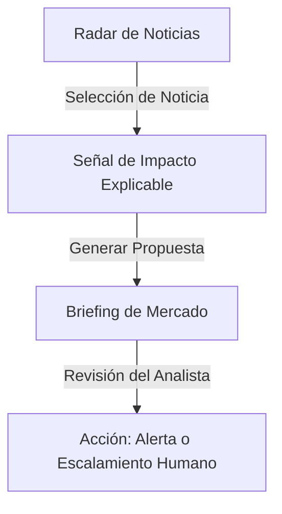

# Proyecto: Inteligencia de Mercado y Recomendaciones Financieras (Track 5)

Este documento detalla las especificaciones de diseño, flujo funcional y requerimientos mínimos de producto para el prototipo interactivo en 48 horas.

---

## 1. Mapeo de Requerimientos y Criterios de Aceptación

El desarrollo se enfoca en resolver la priorización de información financiera para asesores e inversionistas sin automatizar transacciones.



### H.U. 1: Radar de Noticias y Activos
*   **Origen de Datos:** Mínimo 2 fuentes financieras (Reuters, Bloomberg, FT).
*   **Asociación:** Vincular cada titular a uno o varios tickers (ej. `NVDA`, `BTC`, `US10Y`).
*   **Filtros:**
    *   Tipo de Instrumento (Acciones, Criptoactivos, Crédito, Otros).
    *   Buscador / Activo concreto.
    *   Antigüedad (24 horas, 7 días, 30 días).

### H.U. 2: Señal de Impacto Explicable
*   **Dirección:** Clasificar como Positivo, Negativo, Neutral o Incierto.
*   **Confianza:** Porcentaje numérico (%).
*   **Contexto Histórico:** Comparar el evento con rendimientos y correlaciones del pasado.
*   **Descargo:** Disclaimer legal requerido obligatoriamente en vista ("No constituye asesoría...").

### H.U. 3: Briefing de Mercado y Aprobación Humana
*   **Consolidación:** Resumen agrupado por lista de seguimiento / activo.
*   **Acción del Analista:** Selección de estado (Pendiente, Revisada, Escalada, Descartada) y campo de texto para justificar la decisión.
*   **Acciones Seguras:** Botón de "Crear Alerta/Tarea de Revisión" sin ejecutar compras o ventas.

---

## 2. Sistema de Diseño Visual (Aesthetics & Layout)

Para asegurar una apariencia premium e interactiva, implementaremos los siguientes elementos:

*   **Paleta de Colores (Sleek Dark Mode & Clean Highlights):**
    *   Fondo General: `#0a0f1d` (Azul medianoche oscuro)
    *   Paneles/Tarjetas: `#121a2e` (Azul marino profundo)
    *   Bordes/Divisiones: `#1e293b` (Slate)
    *   Texto Principal: `#f8fafc` (Slate claro)
    *   Texto Secundario: `#94a3b8`
    *   Positivo (Bullish): `#10b981` (Esmeralda)
    *   Negativo (Bearish): `#ef4444` (Rojo suave)
    *   Neutral/Incierto: `#f59e0b` (Ámbar)
*   **Tipografía:** Importación de la fuente **Inter** o **Outfit** vía Google Fonts.
*   **Efectos Dinámicos:** Hover states con transiciones suaves (`transition: all 0.2s ease`), sombras sutiles y bordes activos cuando el elemento está seleccionado.

---

## 3. Arquitectura del Estado Reactivo (Mock-up a API-Ready)

El estado se diseñará de forma centralizada en `App.jsx` para que sea trivial conectar un cliente HTTP (`axios` o `fetch`) posteriormente:

```javascript
// Estructuras de datos simuladas
const [news, setNews] = useState(initialNewsData);
const [briefings, setBriefings] = useState(initialBriefingsData);
const [selectedNewsId, setSelectedNewsId] = useState(null);
```

### Funciones de Entrada/Salida para APIs Futuras:
*   `fetchMarketNews()`: Recuperar noticias y alimentar el radar.
*   `analyzeNewsImpact(newsId)`: Enviar noticia al agente de IA para evaluar impacto y confianza.
*   `updateBriefingStatus(briefingId, status, justification)`: Persistir la revisión humana en base de datos.
